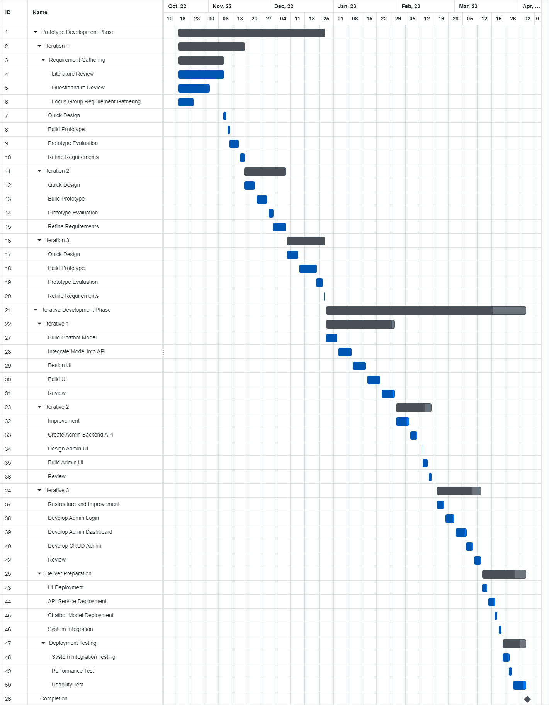
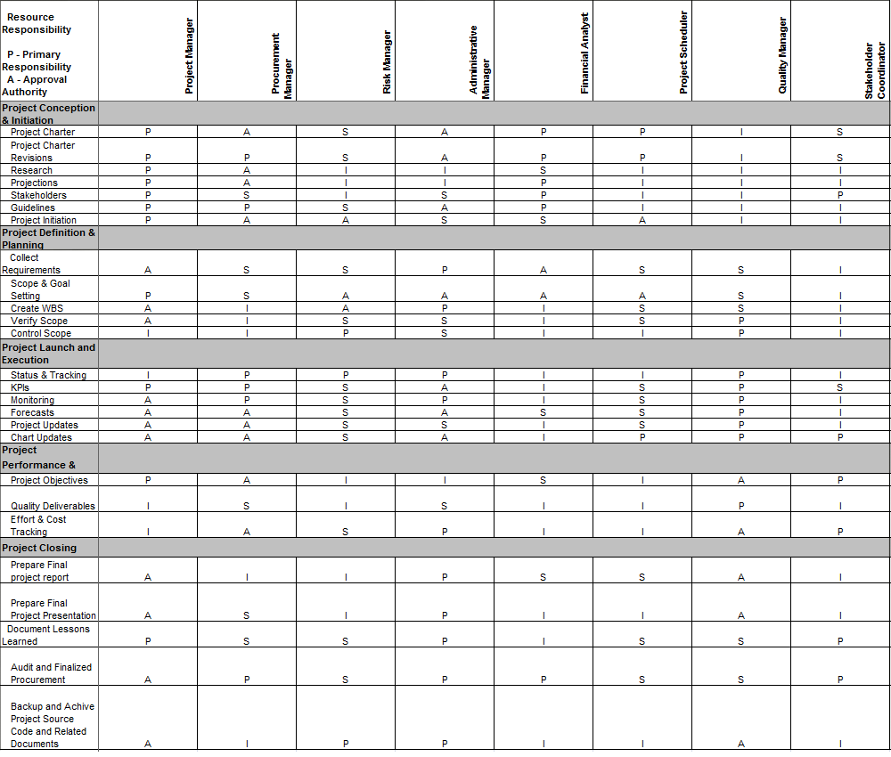
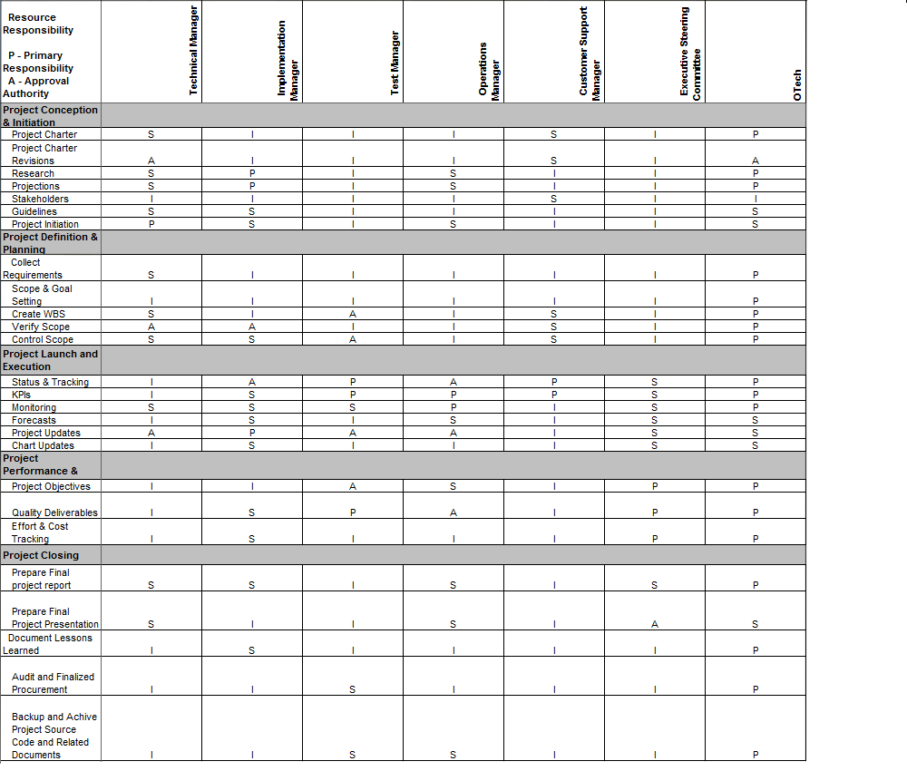

# PROJECT OVERVIEW
## B. PLANNING THE PROJECT

### Project Management Life cycle

The project management life cycle is represented and documented in the form of Gantt Chart which allows QTMT staff to follow the guidelines and achieved the milestone from time to time. The project life cycle WBS breakdown the task and work of every members such as project manager into several modules. Every member have their own roles and part in every stage of the lifecyle based on the constructed WBS.

Project management WBS is shown in the Gantt Chart below:

### Scope
A work breakdown structure (WBS) is created to map all the necessary tasks and develop the process which the WBS will be maintained and approved.

The chatbot assistant system will provide automated customer service and support through conversational interactions. However, the system will not be able to understand or respond to non-verbal cues such as facial expressions or tone of voice. Additionally, the system will be limited to understanding and responding to a specific set of pre-defined questions and commands. The chatbot will not be able to understand or respond to open-ended questions or carry out tasks that fall outside of its programmed capabilities. Furthermore, The chatbot will support only English and Malay languages.

### Risk Identification Chart (Quality, Cost, Time)

| Risk | Quality | Cost | Time |
|------|---------|------|------|
| Lack of user understanding of the chatbot's capabilities | High | Low | Low |
| Technical difficulties with integrating the chatbot into existing systems | High | High | High |
| Difficulty in training the chatbot to understand and respond to a wide range of user inputs | High | High | High |
| Dependence on a single provider for chatbot technology and support | High | High | Low |
| Limited scalability of the chatbot's capabilities | Medium | Low | Low |
| Difficulty in accurately measuring the chatbot's performance | Medium | Low | Low |

### Responsibility Assignment Matrices (RAM)

 

|Task| Nabil Nor | Nurul Fasiha | Syakirah Hanim |
|----|---------------|---------------|---------------|
| Define the chatbot's capabilities and limitations | X |   |   |
|Integrate the chatbot with existing systems |   | X |   |
|Train the chatbot to understand and respond to user inputs |   |   | X |
|Monitor and maintain the chatbot's performance | X | X | X |
|Plan and execute testing and quality assurance | X |   |   |
|Develop the user interface |   | X |   |

   
##### Next: [Project Implementation](C-PROJECT_IMPLEMENTATION.md)
