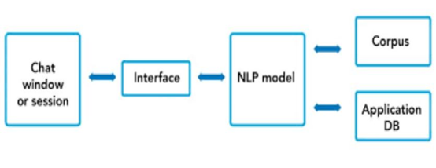

# PROJECT OVERVIEW

## C. IMPLEMENTING THE PROJECT PLAN
The implementations of a chatbot involve a variety of techniques. Understanding what will the chatbot offer and what category falls into helps developers pick the algorithms or platforms and tools to build it. 

### Deliverables:
#### Hardware Requirement:
For the hardware, our group uses the laptop which consists of intel core i5 and 8GB RAM to conduct our project.

#### Software Requirement:
For the software, our group uses python programming language to implement the code for intelligent module in assisting chatbot and PHP programming language to design the website and database connection. 

#### Intelligent System Architecture:
Typical chatbot architecture should consist of the following:
1.	Chat window/session or frontend application interface.
2.	The deep learning model for Natural Language Processing (NLP)
3.	Corpus or training data for training the NLP model application database for processing actions to be performed by the chatbot.

#### Outcomes of the system
There are several steps to develop this project. First is context identification. The input text is preprocessed to standardize it according to the system’s requirements. The proper context is detected based on the keywords used in the text. Next is AIML response system which the user is attempting to have a normal conversation with the bot and the input is mapped to an appropriate pattern. The user receives the response if it is available. Last is query analysis and response system. Upon receiving the personal queries like hi, hello, hey, what are you doing? The input text is analyzed to extract keywords. The user’s request for information is understood based on the keywords and the information is retrieved from database.

### Tasks and Estimated Costs

| Task |  Estimated Costs | Notes |
|-----|----|----|
|   Server Maintenance         |$24000                         |  Monthly Cloud Server      |      
|   Construction supervision   |$30000                         | Supervision on the project | 
|   Cultural resources         |$72000                         |  Investigate and evaluate undertaking                                                 |                              |
|   Equipment and equipment use|$800                           | Equipment preparation and setup                                                       |                              |
|   Project signs              |$400                           |  Installation of project signs     |                            |
|   TOTAL                      |$127200                        |  Estimated     |                              |
