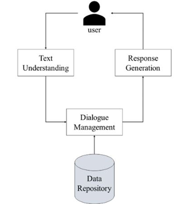
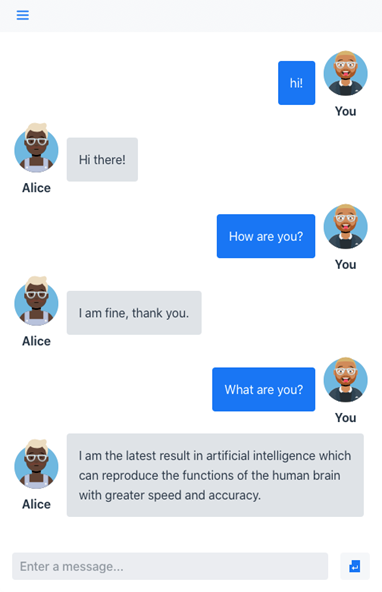

# PROJECT OVERVIEW
## D. EXECUTING THE PROJECT
### Project Design and Coding
Flowchart Design:



### Description of the project coding and implementation
Libraries and Packages required:

Firstly, we will begin by installing a few libraries which are as follows:


```python
def hello():
    print("Hello, World!")
```

The first task that our chatbot must work for is the speech to text conversion. Basically, this involves converting the voice or audio signals into text data.


The following functionality needs to be added to our class so that the bot can respond back.


This is where the chatbot becomes intelligent and not just a scripted bot that will be ready to handle any test thrown at them. The main package that we will be using in our code here is the Transformers package provided by HuggingFace. This tool is popular amongst developers as it provides tools that are pre-trained and ready to work with a variety of NLP tasks. In the code below, we have specifically used the DialogGPT trained and created by Microsoft based on millions of conversations in a given interval of time.


You will get a whole conversation as the pipeline output and hence you need to extract only the response of the chatbot here.


Final code:


### Project Result
The purpose of a chatbot system is to simulate a human conversation. Its architecture integrates a language model and computational algorithm to emulate information online communication  between a human and a computer using natural language.




<br><br><br>
##### Next: [Project Closing](E-PROJECT_CLOSING.md)
