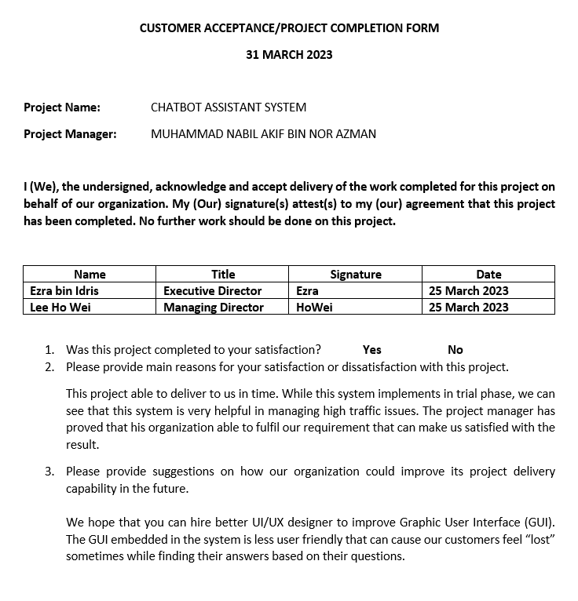
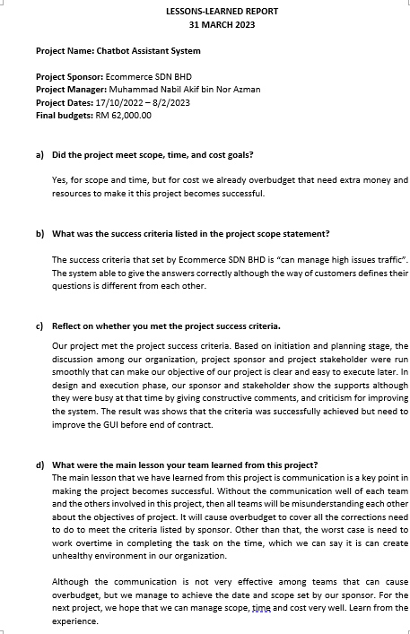

# PROJECT OVERVIEW

## E. COMPLETING THE PROJECT
### Closing Checklist
 

#### 1. Customer Acceptance Form

#### 2. Lessons Learned Document

#### 3. Final Project Report
**CHATBOT ASSISTANT SYSTEM**

**1.0 PROJECT OBJECTIVES**

Chatbot Assistant System is a system that can conduct as semi-auto system that able help worker to handle customers especially in high traffic situation. This can help reduce workload of workers by allowing the system to handle the customer give answers that suitable based on questions. Besides that, Application Program Interface (API) is built by us to enhance the efficiency communication between customer, worker, and the system.

**2.0 SUMMARY OF PROJECT RESULTS**

After the system has been completed, the accuracy of the system shows about 90%, which is we can say the result shows the system able to conduct as semi-auto system later for company.

**3.0 ORIGINAL AND ACTUAL SCHEDULE**

The project member sticks to the Gantt chart scheduled so, the actual progress fits the original schedule.

**4.0 ORIGINAL AND ACTUAL BUDGET**

The actual budget matches the original budget, which means that the team has followed the budget planned at the beginning of the project and does not use any excessive money.

**5.0 PROJECT ASSESSMENT**

**5.1 SCOPE**

The project scope was initiated from the beginning of the project. For instance, the system is not able to detect unique number plates that does not follow the rules set by the government. Unique number plates that cannot be recognise includes number plates that are reflective, and also number plate with special fonts. The system also scopes down the limit of the project by only detect alphabet and number character. Therefore, this system may not be used by countries like China or Thailand, which includes Thai and Mandarin in their number plates.

**5.2 OBJECTIVES**

QTMT Inc. managed to achieve the objectives initialized since the beginning of the project. A system that is artificial intelligence powered, which uses deep-learning technique has been made. Deep learning is used in this project to identify the location of the number plate on the image and also read the characters on the number plate. 
Besides, FAST API is used to implement the python program that are used to recognise the number plate into a html website. By using this method, our objective of building an API in the system was met.

**5.3 IMPACTS**

By creating this system, the time needed of queueing up in front of the barrier gateway before entering the mall’s car park has been reduced. This can avoid traffic obstruction caused by the long queue. The process of paying the parking fees will also become more convenient as shoppers will no longer need to queue up in front of the auto pay machine and wait for their turn to pay for the parking fees. The parking fees will be automatically conducted from the account registered by the users after their number plate has been recognize. 

**6.0 TRANSITION PLAN**

QTMT Inc. staff will provide support when require. The main work of support provided by QTMT Inc.’s staff on the car plate recognition system project are as shown below:

i) Maintain the system

ii) Handling errors and updates of the system

iii) Provide user guidelines for Aeon staff to use the system

iv) Report information to senior management on monthly basis

#### 4. Close Contract

   
##### Next: [Project Presentation](F-PROJECT_PRESENTATION.md)
