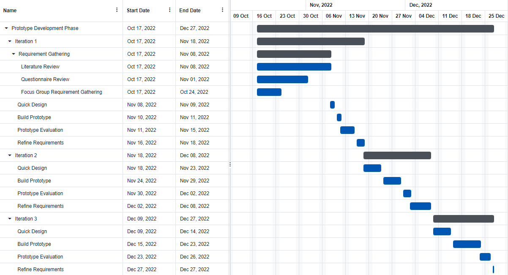
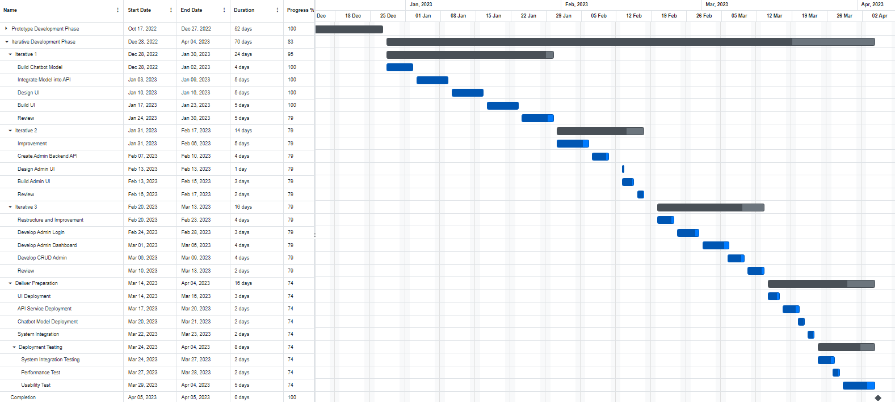
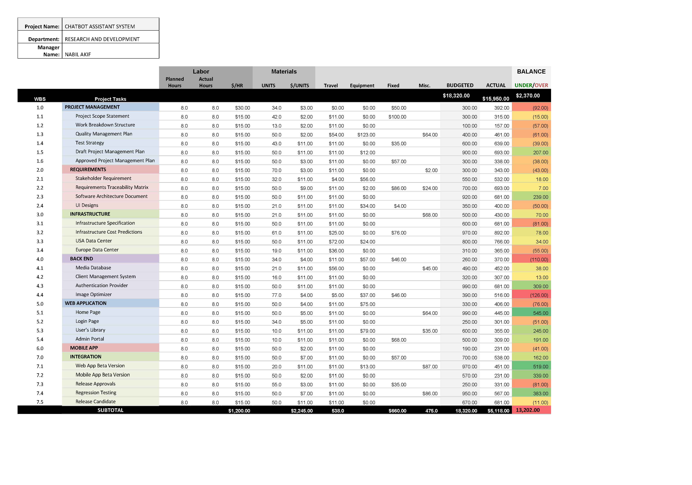
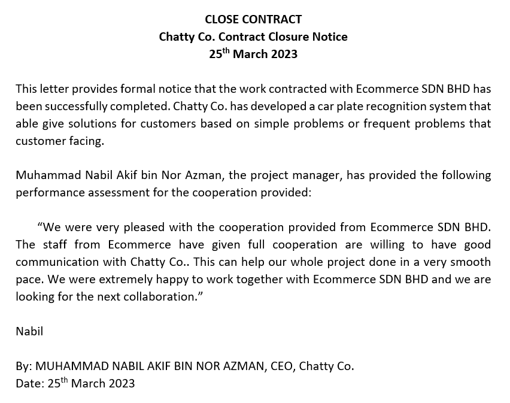

# PROJECT OVERVIEW

## E. COMPLETING THE PROJECT
### Closing Checklist
 

#### 1. Customer Acceptance Form

#### 2. Lessons Learned Document

#### 3. Final Project Report
**CHATBOT ASSISTANT SYSTEM**

**1.0 PROJECT OBJECTIVES**

Chatbot Assistant System is a system that can conduct as semi-auto system that able help worker to handle customers especially in high traffic situation. This can help reduce workload of workers by allowing the system to handle the customer give answers that suitable based on questions. Besides that, Application Program Interface (API) is built by us to enhance the efficiency communication between customer, worker, and the system.

**2.0 SUMMARY OF PROJECT RESULTS**

After the system has been completed, the accuracy of the system shows about 90%, which is we can say the result shows the system able to conduct as semi-auto system later for company.

**3.0 ORIGINAL AND ACTUAL SCHEDULE**

The project member sticks to the Gantt chart scheduled so, the actual progress fits the original schedule.

**4.0 ORIGINAL AND ACTUAL BUDGET**

The actual budget matches the original budget, which means that the team has followed the budget planned at the beginning of the project and does not use any excessive money.

**5.0 PROJECT ASSESSMENT**

**5.1 SCOPE**

The project scope was initiated from the beginning of the project. For instance, the system is not able to conduct in fully auto, which need observation from people also by time to time. This system also cannot give the answer out range of the topic since the rules inside the system already train based on the dataset. Besides that, this system only support in Malay and English Language only since we only covered project for Malaysia company.

**5.2 OBJECTIVES**

Our organization, Chatty Co. managed to achieve the objectives by initializing the project based on criteria listed by our sponsor. We have suggested for our company to try new technology, which is Artificial Intelligence (AI), which can handle uncertain situation, like giving the same answer although each customer have different ways to describe the same problem for a question.

**5.3 IMPACTS**

By releasing this project, the workload of customer service workers can be reduced about 30%, which is the simple problem can be solved by using system only. Other than that, this situation can help customer service to focus more on customer that have high priority, such as the suggestion or answers are not fulfil the solution to solve their problems. This system not just focussing on helping customer service workers only, but for customers also. They can get answers quickly without need to wait answers from customer service worker for about 3 to 5 minutes. The time consuming of customers can be reduced and can maintain the level of their patience. 

**6.0 TRANSITION PLAN**

Chatty Co. staff will provide the support based on the problems that have issued while executing this system. The main work of support provided by Chatty Co. staff on the Chatbot Assistant System project is based on below:

i) Maintaining the system from time to time

ii) Handling errors and updates of the system

iii) Provide guideline for Ecommerce staffs to handle the system

iv) Report information to senior management on monthly basis

#### 4. Close Contract

